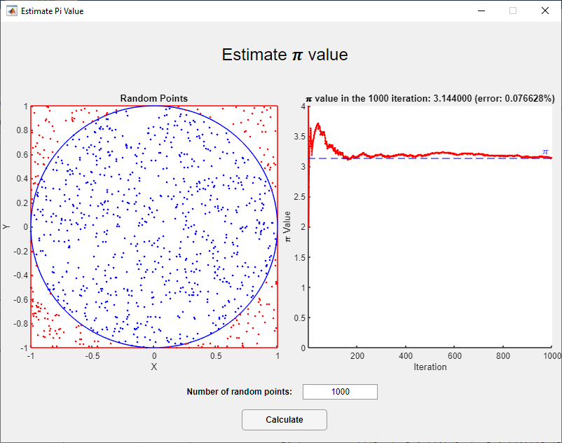

# Estimate π value
## Introduction
Application of π value approximation (using Monte Carlo method) created by MATLAB App Designer and also exported to .m file extension (for MATLAB).

## Calculations
Value of π in <i>i</i>-iteration is equal to:

  

## Setup
Run a file ([estimatePi.mlapp](./estimatePi.mlapp)) in MATLAB App Designer or run another file ([m_estimatePi.m](./m_estimatePi.m)) in MATLAB.

## Preview

  

